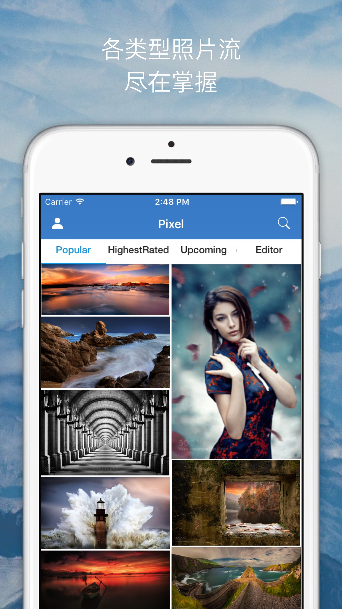
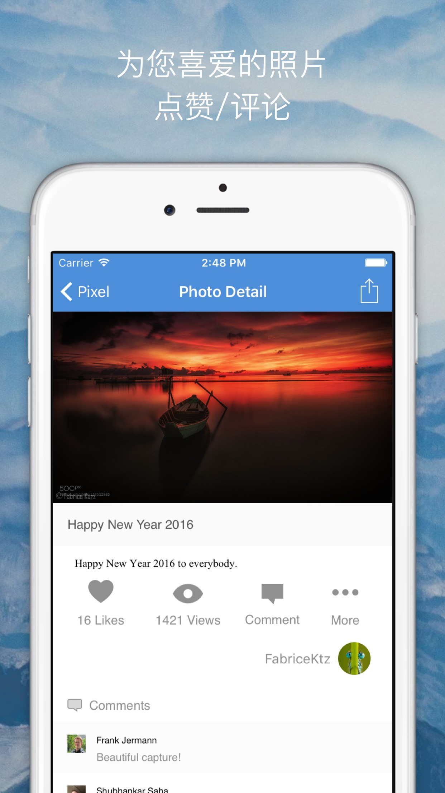
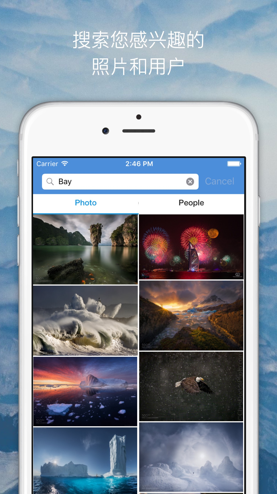

# Pixel - client for 500px

Pixel is a unoffical client for 500px write in Swift. Pixel helps you explore exciting photos in 500px.You can view diffent streams.

# Screenshots

 
 

# Third-party libraries used

+ [Alamofire](https://github.com/Alamofire/Alamofire)

+ [SDWebImage](https://github.com/rs/SDWebImage)

+ [MBProgressHUD](https://github.com/jdg/MBProgressHUD)

+ [MJRefresh](https://github.com/CoderMJLee/MJRefresh)

+ [PureLayout](https://github.com/PureLayout/PureLayout)

+ [Armchair](https://github.com/UrbanApps/Armchair)

# Contact 
Follow and contact me on [Twitter](https://twitter.com/debitosou) or [Sina Weibo](http://www.weibo.com/isongfei). If you find an issue, just open a ticket on it. Pull requests are warmly welcome as well.

# License

Pixel is released under the Apache License. See LICENSE for details.

